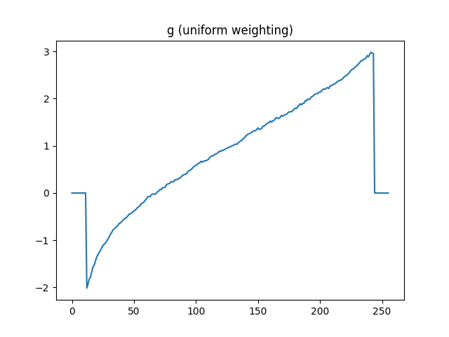

# Homework 2 Report
### dcraw flags
`dcraw -6 -w -T`  
for i in {1..16}; do dcraw -6 -w -T data/door_stack/exposure${i}.nef; done;

### G Function Plot

### Merging exposure stack into HDR
I used values of `Z_min = 0.05` and `Z_max = 0.95`

I am picking two images that are my favorite because they demonstrate different parts of a good HDR image.

This image is the closest to a true HDR image that I was able to create. We can see detail in both the foreground and background, which wasn't visible in any of the individual images. There clearly is an issue with the coloring, which I think is due to a clipping issue.

On the other hand, this image does not do as good of a job with including the high dynamic range, although the colors are much more accurate in this image. We still are able to see some of the detail in the background, which makes this a better image than any of the individual captures from the stack.

### Color Correction and White Balancing

This color corrected version of the image does in fact remove some of the orange tint that was present in the uncorrected image. The wall has a 'cooler' tone to it than it did before. I think I prefer the uncorrected image to the color corrected one. In the original, the colors are warmer, making them more appealing to the eye.

### Photographic Tonemapping
I chose to use values of `K = 0.05` and `B = 0.99`. Below are the results when using both the rgb tonemapping and the luminance tonemapping.

The rgb tonemapping seems to avoid overexposing some of the pixels unlike the luminance tonemapping. For example, the wall right next to the shelves is much more overexposed when using the luminance tonemapping. Besides that, the two images are mostly similar in their appearance.